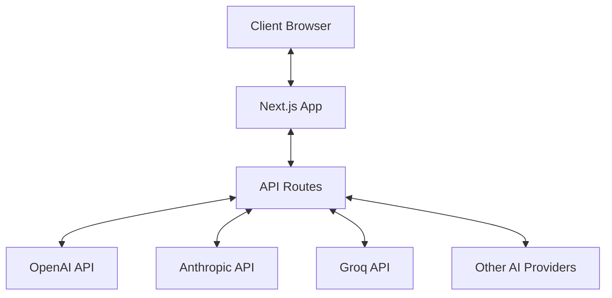
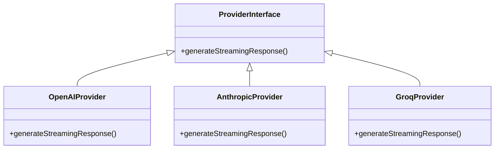
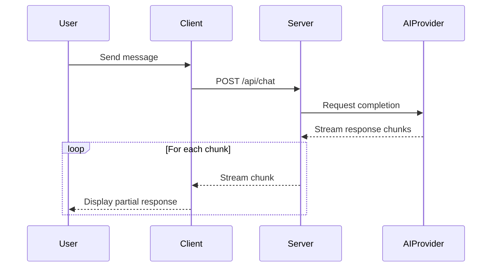

# System Patterns

## Architecture Overview

Omni-Chat follows a client-server architecture with a Next.js frontend and serverless API routes:



## Key Design Patterns

### 1. Provider Adapter Pattern
The application uses an adapter pattern to standardize interactions with different AI providers. Each provider has its own implementation but exposes a consistent interface.



### 2. Streaming Responses
All chat interactions use streaming responses to improve user experience:



### 3. Component Hierarchy
The UI follows a component-based architecture:

```
- Page Component (src/app/page.tsx)
  |- Chat Container
     |- Message List
     |  |- Message (user/assistant)
     |- Input Area
     |  |- Text Input
     |  |- Send Button
     |- Sidebar
        |- Mode Selector
        |- Provider Selector
        |- Settings Panel
        |- Chat History
```

### 4. State Management
The application uses React's useState and useEffect hooks for state management with a focus on:

- Chat sessions (active chat, messages)
- UI state (settings panel visibility)
- Provider/mode configuration
- Message input and submission

### 5. API Interface
The API uses a consistent request/response format:

**Request:**
```typescript
{
  messages: ChatMessage[], // Array of message objects
  provider: Provider,      // Selected AI provider
  mode: ChatMode,         // Selected chat mode
  model?: string,         // Optional model override
  temperature?: number,   // Optional temperature setting
  maxTokens?: number      // Optional max tokens setting
}
```

**Response:**
- Streaming text response using the `ai` package's streaming utilities

## Current Implementation Patterns

1. **Custom Chat SDK**: A wrapper around provider-specific implementations
2. **Provider-specific Streaming**: Each provider has its own stream handling
3. **Simulation Mode**: Fallback when API keys are missing
4. **Dynamic Model Selection**: Models are selected based on provider
5. **Component-Based UI**: Modular components for flexibility
6. **Local Storage Persistence**: Chat history saved to browser storage 